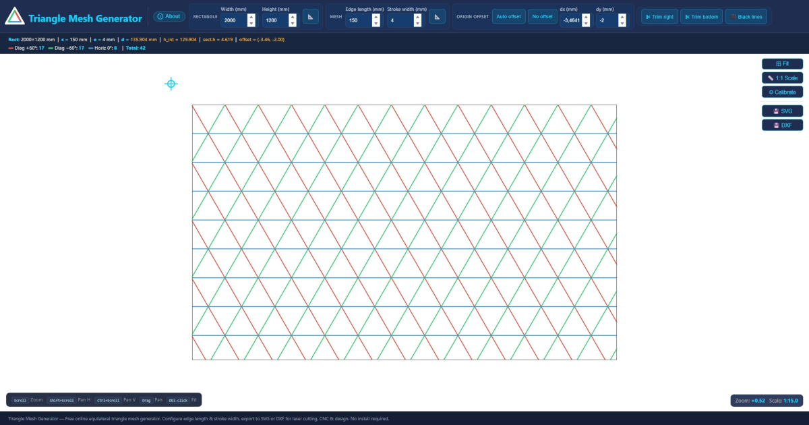

# Triangle Mesh Generator

**Free online equilateral triangle mesh generator**

Generate equilateral triangle mesh patterns inside a rectangle. Configure edge length and stroke width, preview in real time with pan & zoom, and export to SVG or DXF.



**[Launch the tool →](https://trianglemeshgenerator.github.io/)**

---

## Features

- **Real-time preview** — Instant SVG rendering with pan, zoom, and fit controls
- **Configurable geometry** — Set rectangle dimensions, edge length, and stroke width in millimeters
- **SVG export** — Standalone SVG file with correct mm dimensions
- **DXF export** — Industry-standard format for CAD, laser cutters, and CNC machines
- **Screen calibration** — Adjust DPI for true 1:1 scale display with a 5 mm verification grid
- **Trim right & trim bottom** — Symmetry trim lines for precise mesh boundaries
- **Dimension gauges** — Toggle 📐 to show rectangle and mesh dimension annotations
- **Black lines mode** — Switch all mesh lines to black for print-ready output
- **Zero dependencies** — Pure HTML + CSS + JS, works offline via `file://`

## Use Cases

- **Laser cutting** — Generate mesh patterns for decorative panels, lampshades, and enclosures
- **CNC routing** — Export DXF files ready for CNC toolpaths
- **3D printing** — Create infill-like triangle patterns for custom designs
- **Architecture & design** — Parametric triangle grids for facades, screens, and partitions
- **Education** — Visualize equilateral triangle tessellation geometry

## How It Works

The tool generates three families of parallel lines (at 0°, +60°, and −60°) that intersect to form equilateral triangles. The spacing formula `d = c×√3/2 + 3e/2` ensures uniform triangles accounting for stroke width. Lines are clipped to the rectangle boundary using the Cohen-Sutherland algorithm.

### Parameters

| Parameter | Description | Default |
|-----------|-------------|---------|
| **Width** (mm) | Rectangle width | 2000 |
| **Height** (mm) | Rectangle height | 1200 |
| **Edge length** (mm) | Interior side length of the equilateral triangle | 150 |
| **Stroke width** (mm) | Line thickness | 4 |

### Origin Offset

- **Auto offset** — Shifts by `(−e√3/2, −e/2)` so the inner vertex of the first triangle aligns with (0, 0)
- **No offset** — Mesh axes pass through the origin
- **Manual** — Custom dx/dy values in mm

### Trim Lines

- **Trim right** — Vertical cut line with mirror symmetry relative to diagonal crossings
- **Trim bottom** — Horizontal cut line on the last horizontal axis that fits inside the rectangle

## Navigation

| Action | Effect |
|--------|--------|
| **Scroll wheel** | Zoom (×1.12 per step, centered on cursor) |
| **Shift + Scroll** | Horizontal pan |
| **Ctrl + Scroll** | Vertical pan |
| **Click + Drag** | Pan |
| **Double-click** | Fit to rectangle |
| **⊞ Fit** button | Fit view with 6% margin |
| **📏 1:1 Scale** button | True-size display (requires DPI calibration) |
| **⚙ Calibrate** button | Open DPI calibration overlay |

## Tech Stack

- Pure HTML + CSS + vanilla JavaScript (~1800 lines, single file)
- SVG rendering with viewBox in millimeters
- Cohen-Sutherland line clipping algorithm
- Canvas-based calibration grid with cm rulers
- No framework, no build step, no external dependencies
- Works offline — just open the HTML file

## File Structure

```
MaillageTriangle/
├── index.html           # Full application (single file)
├── preview.png          # Social sharing image (1200×630)
├── robots.txt           # Search engine crawler rules
├── sitemap.xml          # Sitemap for search engines
├── .ai-instructions.md  # Technical context for AI assistants
└── README.md            # This file
```

## License

MIT
